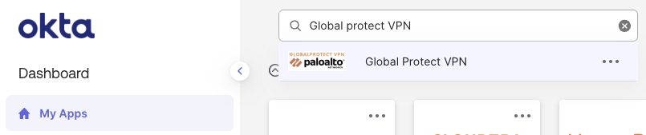
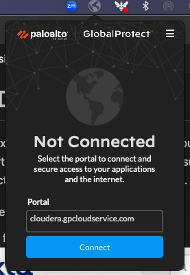
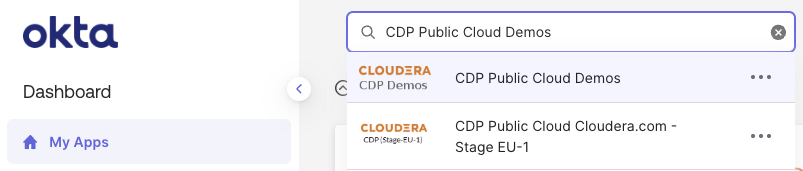
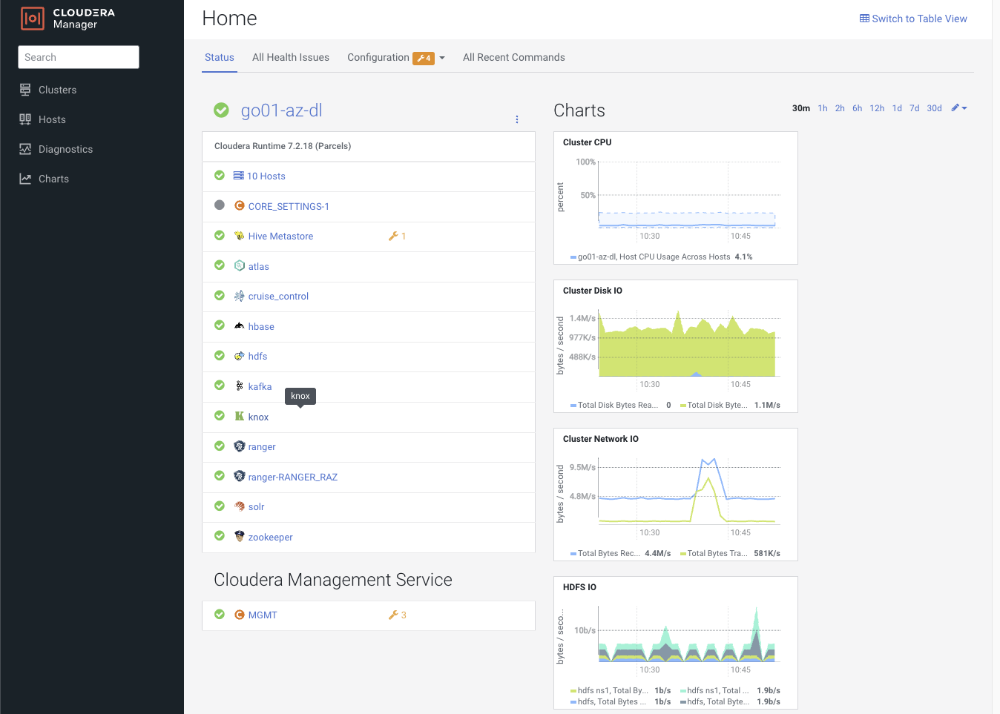

# Cloudera Data Platform and pre-requisites
For this hands-on experience, you will be using the Cloudera Data Platform. Ensure these steps are met before you start the Hands-On experience. Make sure you have access to the Cloudera VPN. You can check this directly in Okta and on your own laptop. 

- For Okta under MyApps: 
    - Search for “Global Protect VPN
    

- On your laptop:
    - Ensure you’re connected to cloudera.gpcloudservice.com as shown in the below image.
        - 
    - Hit connect and an Okta challenge will pop up. Complete the challenge and get connected. 

- Once you’re connected to VPN, please make sure you check in Okta for Cloudera Public Cloud Demos under MyApps:
    
    - The tile should show “CDP Demos”. Click on it, and ensure you’re able to access it. 
    - Once you are inside the CDP Demos tile and authenticated correctly, please verify you are able to view all the UIs. To ensure the VPN is working properly, try opening up the Cloudera Manager in the Azure Data Lake. To reach this, please go to “Management Console > Environments > go01-demo-azure > Data Lake > CM-UI (Cloudera Manager User Interface).”
- A new tab should appear in your browser. Ensure you can see something similar to this:
    - 

This concludes this section of the Hands-On lab prerequisites.