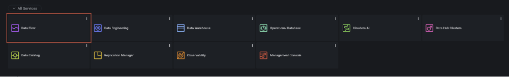
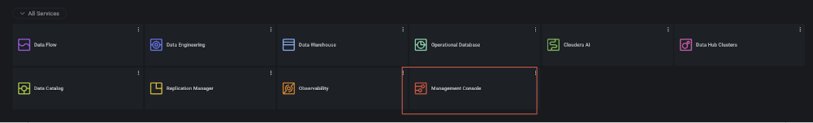
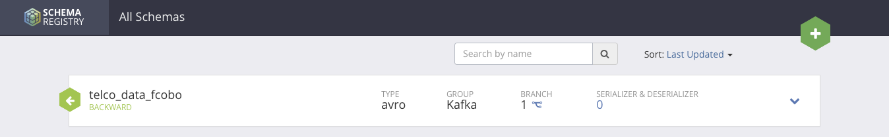
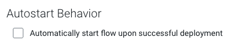

# Cloudera Data Flow - Consume ADLS CSV and transform to Kafka Topic
## Configuring your first CDF Flow and getting familiar with Kafka
Cloudera DataFlow (CDF) is a hybrid data movement and streaming service offered as part of Cloudera Data Platform (CDP), available both on-premises and in the public cloud. It provides a fully managed, scalable, and secure platform for real-time and batch data ingestion, transformation, and distribution across diverse systems.

For this lab, you will be learning how to configure a Cloudera Data Flow flow that consumes a CSV file in Azure ADLs storage, moves it to CDF, analyzes the CSV files, transforms it into a JSON file and sends it off to a Kafka broker to share the messages to be later consumed by another flow that will insert them into your Cloudera Data Warehouse database.

### Finding the flow names and resources
From the home page, please click on the Data Flow (purple) icon.

Once you’re here, expect to get a tour from your presenters. You’ll be explained what to do next. 

To configure the flow, please check the `"Projects > Filter by Projects CSA_AMER_HOL_CDF"`. 
1. Click the three dots at the end of the tile.
1. Select "**View Project Resources**"
1. This will take you to a screen that shows two deployments.
    - `CSA_AMER_HOL_ADLS_KFK`
    - `CSA_AMER_HOL_KAFKA_TO_DL`

1. Take note of the names (copy them to a notepad or text editor).

### Configuring your Kafka schema in Schema Registry
Before you start the Cloudera Data Flow configuration, one prerequisite is to pre-create the schema for the Kafka topic. Follow the next steps to complete this section. 

#### Step 1 - Finding the Kafka Data Hub cluster
1. From your Cloudera Home Page, go to All Services > Management Console. 
    
1. From your Management Console, check the **Environments** section and select the Azure environment called _go01-demo-azure_.
1. Once you are  here, you will need to locate the **Data Hubs** section and click on it. 
1. Once you are in the **Data Hub** section, find the Data Hub cluster called _go01-kafka-azure_. Click on the name. 
1. Once you are redirected to the Kafka data hub cluster page, look for the Services section and select the Schema Registry option. This will redirect you to another page and will require VPN connection. If you’re not connected to the VPN, this will not open up. Ensure you are connected to the VPN or follow this guide’s prerequisites section above.

#### Step 2 - Creating the Kafka Schema for your topic  in Schema Registry
[!NOTE]
> Please remember to change {CSA_ALIAS} here for your alias. 
> For example, fcobo. A full example of the `name` property below should look like this: 
> telco_data_fcobo

1. Once you are inside the **Schema Registry** home page, search for the green `+` button on the top right corner.
    
1. Kafka Topic Schema for Kafka Schema Registry:
    ```json
    {
    "type" : "record",
    "namespace" : "telco",
    "name" : "telco_data_{CSA_ALIAS}",
    "fields" : [
        { "name" : "multiplelines" , "type" : "string" },
        { "name" : "paperlessbilling" , "type" : "string" },
        { "name" : "gender" , "type" : "string" },
        { "name" : "onlinesecurity" , "type" : "string" },
        { "name" : "internetservice" , "type" : "string" },
        { "name" : "techsupport" , "type" : "string" },
        { "name" : "contract" , "type" : "string" },
        { "name" : "churn" , "type" : "string" },
        { "name" : "seniorcitizen" , "type" : "string" },
        { "name" : "deviceprotection" , "type" : "string" },
        { "name" : "streamingtv" , "type" : "string" },
        { "name" : "streamingmovies" , "type" : "string" },
        { "name" : "totalcharges" , "type" : "string" },
        { "name" : "partner" , "type" : "string" },
        { "name" : "monthlycharges" , "type" : "string" },
        { "name" : "customerid" , "type" : "string" },
        { "name" : "dependents" , "type" : "string" },
        { "name" : "onlinebackup" , "type" : "string" },
        { "name" : "phoneservice" , "type" : "string" },
        { "name" : "tenure" , "type" : "string" },
        { "name" : "paymentmethod" , "type" : "string" }
    ]
    }
    ```
1. Click the button and register the follow schema with the following properties: 
    - **Name**: telco_data_{csa_alias}
    - **Description**: CSA HOL Schema Registration for CDF Flow for {CSA_ALIAS}.
    - **Type**: Leave the default “Avro schema provider” value.
    - **Schema Group**: Leave the default “Kafka” value.
    - **Compatibility**: Backward.
    - **Evolve**: checkbox should be blue (selected).
    - **Schema Text**: Replace what’s highlighted before creating the schema. 
1. Click on **Save** to register the schema.


### Create your first CDF Catalog deployment
1. Go to Catalog in the left-hand navigation bar inside the CDF data service UI. 
1. In here, make sure you filter by collection “CSA_AMER_HOL_COLLECTION”.
1. Once you have filtered out the collection you should see two definitions here: 
    - [`CSA_AMER_HOL_ADLS_TO_KF`](../resources/CDF/cdf_adls_to_kafka.json)
    - [`CSA_AMER_HOL_KFK_TO_DL`](../resources/CDF/cdf_kafka_to_dl.json)
1. The two above flow files will be the ones you will be using to deploy your CDF flows.
1. Select “CSA_AMER_HOL_ADLS_KFK” and click the blue “Deploy” button in the popup blade that shows up.

### Configuring your CSA_AMER_HOL_ADLS_KFK deployment
Once you have hit the blue Deploy button, follow the steps below: 

#### Step 1 - Overview
1. **Deployment Name**: This should be `CSA-{CSA_ALIAS}-ADLS-TO_KFK`.
1. **Target Workspace**: Azure environment `go01-demo-azure`.
1. **Target Project**: select `CSA_AMER_HOL_CDF`.
1. Click the **Next** button.

#### Step 2 - NiFi configuration
1. Autostart Behavior
    - Make sure you **uncheck** this.
    - 
1. Leave the rest of the values in this screen as default.
1. Click the Next button.

#### Step 3 - Parameters
In this step, you will be required to change a few parameters. You will change them by clicking on the pencil looking icon at the far right side of the parameter’s name. Change the following parameters:

- **Kafka Producer ID**: `{CSA_ALIAS}-producer`. 
- **Kerberos Password**: Set your Cloudera Workload Password here.
- **Kerberos Principal**: Set your Cloudera Workload Username here.
- **Topic Name**: `telco_data_{CSA_ALIAS}`.
- **schema.name**: Add the same value as Topic Name (above in #4).
- The rest of the parameters should be left untouched. 
- Click the **Next** button.

#### Step 4 - Sizing & Scaling
1. **NiFi Node Sizing**: choose Extra Small.
1. **Number of NiFi Nodes**: leave 1 as default.
1. Leave **Autoscaling** unchecked.
1. **Storage Selection**: select Standard.
1. Click the Next button.

#### Step 5 - Key Performance Indicators
Leave this section empty and do not configure any KPIs. Add some if you feel curious but this is not mandatory for this Hands-On lab.

#### Step 6 - Review
1. Take a minute to review the configuration.
1. Click the Deploy button. This will redirect you to the deployment status page.

### Configuring your Flow processors, controllers and services
At this point, you have passed in all of the required values in the previous step, but we will be doing an overview to explain where those values are being used and why they are necessary. This will be presented by Fernando Cobo during the Hands-On laboratory.