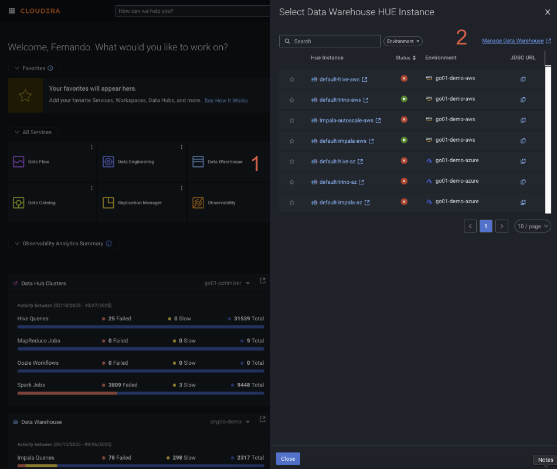

# Cloudera Data Warehouse - Database and Table Creation
For the next step in the Hand-On lab, we will prepare a database and a table, where our Kafka topics will be stored. This Virtual Warehouse will work as our data landing spot. 

### Reaching the Cloudera Data Warehouse Hive Virtual Warehouse for Azure
1. From your Cloudera Home Page, select from the All Services section, Data Warehouse.
    
1. This previous step will result in a pop-up blade showing up on the right side of the screen. 
1. From this blade, look at the upper right corner and click on "Manage Data Warehouse". 
1. This will take you to the Cloudera Data Warehouse services and you’ll be able to interact with the Virtual Warehouse services directly. 

#### Step 1 - Opening Hue in the Hive Virtual Warehouse
For this next step, we will require you to open a Hue session in the Virtual Warehouse. This session will be used to create the database that will be consumed by one of our upcoming CDF flows and where we will create our Iceberg table to land the Kafka messages inside the topic we created earlier. Follow these steps to locate the Hive Virtual Warehouse:
1. Inside the Cloudera Virtual Warehouse page, look for the one called default-hive-az. 
1. Look at the right inside this Virtual Warehouse section and you will see an icon with the name of “Hue”. Click on that icon and you will be redirected to the Hue interface. In this scenario, Hue will use your SSO credentials and use that to log in automatically. You don’t have to give Hue user and password.

#### Step 2 - Creating your database
Once you are inside Hue, you will be presented with a SQL like text editor. Inside this text editor run the following code: 

```sql
-- CREATE DATABASE ${CSA_ALIAS}

CREATE DATABASE ${CSA_ALIAS};
```

#### Step 3 - Creating your Iceberg table

```sql
CREATE EXTERNAL TABLE ${CSA_ALIAS}.telco_iceberg_kafka (
  `multiplelines` string,
  `paperlessbilling` string,
  `gender` string,
  `onlinesecurity` string,
  `internetservice` string,
  `techsupport` string,
  `contract` string,
  `churn` string,
  `seniorcitizen` string,
  `deviceprotection` string,
  `streamingtv` string,
  `streamingmovies` string,
  `totalcharges` string,
  `partner` string,
  `monthlycharges` string,
  `customerid` string,
  `dependents` string,
  `onlinebackup` string,
  `phoneservice` string,
  `tenure` string,
  `paymentmethod` string
)
STORED BY 'org.apache.iceberg.mr.hive.HiveIcebergStorageHandler'
TBLPROPERTIES (
  'table_type'='ICEBERG',
  'engine.hive.enabled'='true',
  'iceberg.catalog.type'='hive',
  'write.format.default'='parquet'  -- Or 'avro' or 'orc', depending on your choice
);
```

Once you have created the database and the table, you should be ready to deploy the next CDF flow, which will consume the Kafka messages and insert them into the Iceberg table.