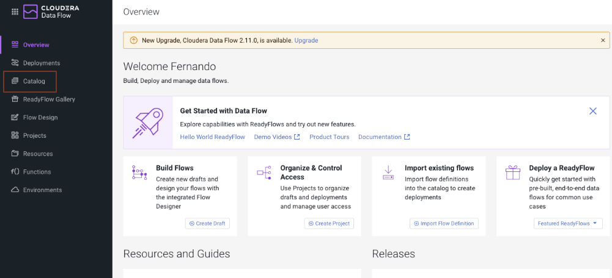
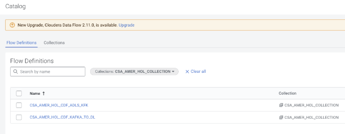

# Cloudera Data Flow - Consuming Kafka Topic messages and inserting them into Iceberg table
Once you have created your database and Iceberg table, you should be ready to deploy the final flow, which will consist of consuming the Kafka Topic messages and storing them into the Iceberg table. 

### Create your second CDF Catalog deployment
1. Go to Catalog in the left hand navigation bar inside the CDF data service UI. 
    
1. In here, make sure you filter by collection `CSA_AMER_HOL_COLLECTION`.
1. Once you have filtered out the collection you should see two definitions here: 
    1.  `CSA_AMER_HOL_ADLS_KFK`
    1.  `CSA_AMER_HOL_KAFKA_TO_DL`
        - 

1. Select `CSA_AMER_HOL_KFK_TO_DL`.
1. Click the blue **Deploy** button in the popup blade that shows up.

### Configuring your CSA_AMER_HOL_KFK_TO_DL deployment
Once you have hit the blue Deploy button, follow the steps below: 

#### Step 1 - Overview
1. **Deployment Name**: CSA1_`{CSA_ALIAS}`_KFK_TO_DL.
1. **Target Workspace**: Azure environment _go01-demo-azure_.
1. **Target Project**: select _CSA_AMER_HOL_CDF_.
1. Click the **Next** button.

#### Step 2 - NiFi configuration
1. Leave all values in this screen as default.
1. Click the Next button.

#### Step 3 - Parameters
In this step, you will be required to change a few parameters. You will change them by clicking on the pencil looking icon at the far right side of the parameter’s name.  Change the following parameters:

1. **Database**: should be your alias and what you used to create the database in the previous step in Hue.
1. **Kafka Consumer Group Id**: set the value to {CSA_ALIAS}001.
1. **Topic Name**: set to telco_data_{CSA_ALIAS}.
1. **Kerberos Password**: set your Cloudera Workload Password.
1. **Kerberos Principal**: set your Cloudera Workload Username.
1. The rest of the parameters should be left untouched. 
1. Click the **Next** button.

#### Step 4 - Sizing & Scaling
1. **NiFi Node Sizing**: choose Extra Small.
1. **Number of NiFi Nodes**: leave 1 as default.
1. Leave **Autoscaling** unchecked.
1. **Storage Selection**: select Standard.
1. Click the **Next** button.

#### Step 5 - Key Performance Indicators
Leave this section empty and do not configure any KPIs. Add some if you feel curious but this is not mandatory for this Hands- On lab.

#### Step 6 - Review
1. Take a minute to review the configuration.
1. Click the **Deploy** button. This will redirect you to the deployment status page.

### Configuring your Flow processors, controllers and services
At this point, you have passed in all of the required values in the previous step, but we will be doing an overview to explain where those values are being used and why they are necessary. This will be presented by Fernando Cobo during the Hands-On laboratory.